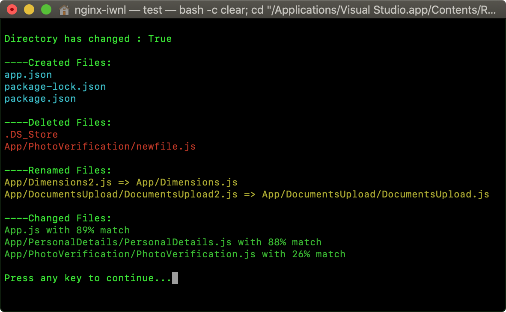

FileSystemWatcher [](https://github.com/AbdelhamidLarachi/FileSystemWatcher/blob/master/FileSystemWatcher/LICENSE) [](https://www.nuget.org/packages/AL-FileSystemWatcher/)
========

`FileSystemWatcher` is a C# library whose purpose is to detect directory changes and return all `renamed`, `moved`, `created`, and `deleted` files. It is able to spot renamed files without requiring the use of hashcode comparisons or real time tracking. It targets `netstandard2.1+`.

## Examples

All you have to do in order to use this library is to initialize the local directory you want to watch, using : 

```csharp
namespace FileSystemWatcher
{
    class Program
    {
        static void Main(string[] args)
        {
            // Choose a directory to watch
            string directory = @"/Users/nginx-iwnl/Desktop/Project";

            // Initialize directory 
            FileSystemWatcher.BeginInit(directory);

            // Optional: using ignore patterns
            string[] ignore = { ".exe", "/node_modules" };
            FileSystemWatcher.BeginInit(directory, ignore);
        }
    }
}
```

Then modify the directory content, after that you call EndInit to get result : 

```csharp
using System;

namespace FileSystemWatcher
{
    class Program
    {
        static void Main(string[] args)
        {
            // Choose a directory to watch
            string directory = @"/Users/nginx-iwnl/Desktop/Project";

            // End directory watch
            ChangeModel result = FileSystemWatcher.EndInit(directory);

            // Print Result
            Console.WriteLine("Directory has changed : {0}", result.HasChanged);
            Console.WriteLine("\n----Created Files:");

            foreach (var file in result.Changes.created)
                Console.WriteLine(file);

            Console.WriteLine("\n----Deleted Files:");

            foreach (var file in result.Changes.deleted)
                Console.WriteLine(file);

            Console.WriteLine("\n----Renamed Files:");

            foreach (var file in result.Changes.renamed)
                Console.WriteLine("{0} => {1}", file.prevName, file.name);

            Console.WriteLine("\n----Changed Files:");

            foreach (var file in result.Changes.changed)
                Console.WriteLine("{0} with {1}% match", file.filename, file.match);
        }
    }
}

```

expected result:



provided implementations:

- `created files`
- `deleted files`
- `renamed files`
- `moved files`
- `changed files with similarity percentage %`
